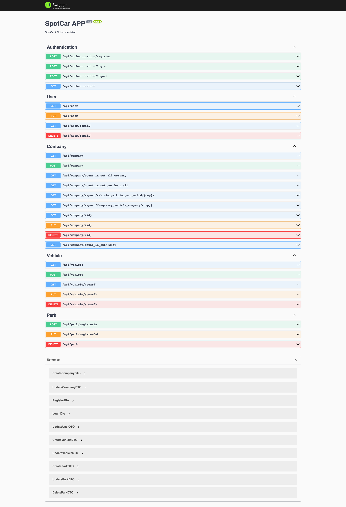

<h1 align="center">
    <p align="center">
      
    </p>
    ⚙️ <a href="#" alt=""> SpotCar </a>
</h1>

<h3 align="center">
    ⚙️ Gerencie estacionamentos integrando com a SpotCar. 👨‍💼
</h3>

<p align="center">
  

  
  
  <a href="https://github.com/rbosco/spotcar/commits/master">
    
  </a>
    
   
   <a href="https://github.com/rbosco/spotcar/stargazers">
    
  </a>
</p>

Tabela de conteúdos
=================

   * [Sobre o projeto](#sobre-o-projeto)
   * [Funcionalidades](#funcionalidades)
   * [Swagger](#swagger)
   * [Como executar o projeto](#como-executar-o-projeto)
     * [Pré-requisitos](#pre-requisitos)
     * [Rodando o servidor](#rodando-o-backend)
     * [Rodando os testes](#rodando-testes)
   * [Tecnologias](#tecnologias)
     * [Server](#tecnologias-server)
     * [Utilitários](#utilitarios)
   * [Autor](#autor)
   * [Licença](#licenca)


## 💻 Sobre o projeto <a name="sobre-o-projeto"></a>

⚙️ O SpotCar fornece API's para gestão de estacionamentos.

---

## ⚙️ Funcionalidades <a name="funcionalidades"></a>

- [x] O seu sistema pode se integrar a SpotCar para:
  - [x] Cadastrar estabelecimento.
  - [x] Relatórios com a visão do dono.
  - [x] Gerenciar veículos.
  - [x] Controle de entrada e saída de veículos.

---

## 🎨 Swagger <a name="Swagger"></a>

Acesse o Swagger para ver a documentação das API's da SpotCar.

<a href="https://www.figma.com/file/8szO6rJwdHlSaF95n2vKgW/GoBarber">
  
</a>

<p align="center" style="display: flex; align-items: flex-start; justify-content: center;">
  
</p>

---

## 🚀 Como executar o projeto <a name="como-executar-o-projeto"></a>

💡 Para visualizar o funcionamento das API's do SpotCar é necessário que o Backend esteja sendo executado para funcionar

### Pré-requisitos <a name="pre-requisitos"></a>

Antes de começar, você vai precisar ter instalado em sua máquina as seguintes ferramentas:
[Git](https://git-scm.com), [Nodejs](https://nodejs.org/en/). 
Além disto é bom ter um editor para trabalhar com o código como [VSCode](https://code.visualstudio.com/).

#### 🎲 Rodando o Backend <a name="rodando-o-backend"></a>

```bash

# Clone este repositório
$ git clone https://github.com/rbosco/spotcar.git

# Acesse a pasta do projeto no terminal/cmd
$ cd spotcar

# Execute o docker-compose build
$ docker-compose up --build

# O servidor inciará na porta:3000 - acesse http://localhost:3000/api 

```

#### 🎲 Rodando os testes <a name="rodando-testes"></a>

```bash

#Execute os testes
$ npm run test

```

#### 🎲 Acessando o Swagger <a name="acessando-swagger"></a>

O Swagger será executado na rota /api - acesse (http://localhost:3000/api)

---

## 🛠 Tecnologias <a name="tecnologias"></a>

As seguintes ferramentas foram usadas na construção do projeto:

-   **[EditorConfig](https://editorconfig.org/)**

#### **Server** ([Nodejs 14](https://nodejs.org/en/)) <a name="tecnologias-server"></a>

-   **[NestJS](https://nestjs.com/)**
-   **[TypeORM](https://typeorm.io/)**
-   **[Mysql](https://www.mysql.com/)**
-   **[Swagger](https://laravel.com/)**

> Veja o arquivo  [package.json](https://github.com/rbosco/spotcar/blob/main/package.json)

#### **Utilitários** <a name="utilitarios"></a>

-   Editor:  **[Visual Studio Code](https://code.visualstudio.com/)**
-   Teste de API:  **[Insomnia](https://insomnia.rest/)**

---

## 🦸 Autor <a name="autor"></a>

<a href="https://github.com/rbosco">
 
 <br />
 <sub><b>Rômulo Basilio Bosco</b></sub></a>
 <br />

[](https://www.linkedin.com/in/romulobbosco/) 
[](mailto:romulo.bbosco@gmail.com)

---

## 📝 Licença <a name="licenca"></a>

Este projeto esta sob a licença [MIT](./LICENSE).

Feito com ❤️ por Rômulo Basilio Bosco 👋🏽 [Entre em contato!](https://www.linkedin.com/in/romulobbosco/)